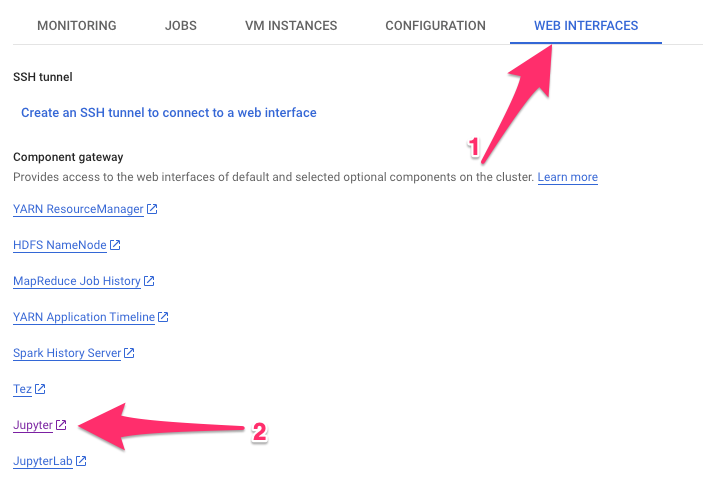

# Machine Learning with Apache Spark & Cassandra (on Google Dataproc)
## Spark + Cassandra = :heart:
## Spark + DataStax Astra = :fire: :rocket: :stars:

#### A hands-on workshop delivered by DataStax's Developer Advocates team. 
Want to learn about the awesomness of distributed databases and computational systems?
Want to get hands-on with DataStax's Cassandra-as-a-Service offering (_for free!_) and use popular Machine Learning tools and algorithms?
Join in and follow along with this workshop!

This project is an adaptation of [Machine Learning with Apache Spark & Cassandra](https://www.datastax.com/resources/webinar/introduction-machine-learning-apache-cassandratm-and-apache-sparktm).  Original code can be found [here](https://github.com/DataStax-Academy/machine-learning-workshop-online).

## Requirements

* [git](https://git-scm.com/book/en/v2/Getting-Started-Installing-Git)
* [DataStax Astra Registration](http://astra.datastax.com) (_sign up with the email you used to register for the workshop!_)
* [gcloud SDK](https://cloud.google.com/sdk/docs#install_the_latest_cloud_tools_version_cloudsdk_current_version)
* [GCP dataproc](https://console.cloud.google.com/dataproc/clusters)
* [GCS bucket](https://console.cloud.google.com/storage)

## Installation / Setup

```
git clone https://github.com/ajgoade/machine-learning-workshop-astra-GCP-dataproc.git
cd machine-learning-workshop-astra-GCP-dataproc
  - Download the [Secure Connect Bundle](https://docs.datastax.com/en/astra/aws/doc/dscloud/astra/dscloudObtainingCredentials.html) for your Astra Database
  - Move the Secure Connect Bundle to [./jupyter/secureconnect](./jupyter/secureconnect) 
  - Modify ./jupyter/gcp/astra_connect_package.sh Update your Secure Connect Bundle
  - Modify ./jupyter/gcp/dataproc_creation_script.txt Update your Google Cloud specific information. 
gsutil cp -r ./jupyter gs://andygoade-dev/notebooks/jupyter

```

## Labs
 
- For the Cassandra lab, access [DataStax Developer Studio on Astra](https://docs.datastax.com/en/astra/aws/doc/dscloud/astra/dscloudConnectStudio.html)
- For the Spark labs, access Jupyter Notebooks: Click on your [cluster in GCP dataproc](https://console.cloud.google.com/dataproc/clusters), (1) select Web Interfaces, (2) then scroll to find Jupyter 



## Known Issues


